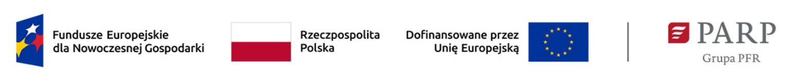

	<h2 class="section-heading text-uppercase">Realizacja Projektu</h2>

Firma <strong>CAUSALITY PROSTA SPÓŁKA AKCYJNA uzyskała dotację z Unii Europejskiej</strong> na projekt
<strong>„Opracowanie elastycznej i uniwersalnej metody generowania danych tekstowych i obrazowych o
wysokiej jakości i wiarygodności na potrzeby budowy komercyjnych rozwiązań bazujących na uczeniu
maszynowym”</strong> w ramach programu Fundusze Europejskie dla Nowoczesnej Gospodarki 2021-2027, Priorytet
Wsparcie dla przedsiębiorców; Działanie Ścieżka SMART nr <strong>FENG.01.01-IP.02-2364/23</strong>

Przedmiotem projektu jest opracowanie elastycznej i uniwersalnej metody generowania danych tekstowych i
obrazowych o wysokiej jakości i wiarygodności na potrzeby budowy komercyjnych rozwiązań bazujących na
uczeniu maszynowym (ML).

W celu stworzenia rozwiązania przewidziano realizację 4 zadań badawczych:

- Opracowanie modeli generatywnych pozwalających na pozyskiwanie syntetycznych danych tekstowych na
podstawie wzorców dostarczonych przez użytkownika z zachowaniem semantycznej poprawności i
minimalizacją zjawiska halucynacji (badania przemysłowe).
- Integracja rozwiązania generowania danych tekstowych w całościowe rozwiązanie oparte o architekturę
mikroserwisową (prace rozwojowe).
- Opracowanie modeli generatywnych pozwalających na pozyskiwanie syntetycznych danych wizualnych
(obrazów) na podstawie wzorców dostarczonych przez użytkownika z zachowaniem semantycznej poprawności
i minimalizacją zjawiska halucynacji (badania przemysłowe).
- Integracja rozwiązania generowania danych wizualnych w kompletne rozwiązanie oparte o architekturę
mikroserwisową (prace rozwojowe).

Produkt będący rezultatem projektu będzie miał formę platformy web wraz z interfejsem API i będzie wdrożony
do sprzedaży przez spółkę Causality. Rozwiązanie będzie oferowane w pierwszej kolejności podmiotom
tworzącym oprogramowanie bazujące na sztucznej inteligencji (AI), w tym ML. Pozwoli im ono na poszerzenie
grupy klientów i przyspieszenie procesu tworzenia tego rodzaju oprogramowania. Uniwersalny charakter
produktu pozwoli na jego wykorzystanie do tworzenie rozwiązań dla dowolnej branży, ale w szczególności
będzie on użyteczny w obszarach wymagających bardzo wysokiej skuteczności (np. medycyna, finanse,
przemysł) i w sytuacji problemów z dostępnością/jakością danych uczących.

Proponowane w projekcie podejście do zagadnień problemowych w obszarze generowania danych
syntetycznych umożliwi uzyskanie przewagi konkurencyjnej dzięki zapewnieniu wyższej jakości i rzetelności
generowanych danych.

#FunduszeUE #FunduszeEuropejskie

Wartość projektu : 10 052 632,00 zł

Wysokość wkładu z Funduszy Europejskich: 7 223 363,75 zł

  <h2 class="section-heading text-uppercase">Realizacja Projektu</h2>

Projekt współfinansowany przez Unię Europejską w ramach konkursu 1/1.1.1/2022 - Szybka ścieżka - Innowacje cyfrowe w ramach Działania 1.1: Projekty B+R przedsiębiorstw Poddziałanie 1.1.1 Badania przemysłowe i prace rozwojowe realizowane przez przedsiębiorstwa

  <strong>CAUSALITY PROSTA SPÓŁKA AKCYJNA</strong> zrealizowała projekt:

  <strong>
    „Silnik wyszukiwania semantycznego i eksploracji danych dostępny dla użytkowników biznesowych”
  </strong>

w ramach Działania 1.1: Projekty B+R przedsiębiorstw Poddziałanie 1.1.1 Badania przemysłowe i prace rozwojowe realizowane przez przedsiębiorstwa Programu Operacyjnego Inteligentny Rozwój 2014-2020

  Wartość projektu: <strong>5 520 888.16 zł</strong> 
  Wartość dofinansowania: <strong>4 181 246.47 zł</strong>

Nr Umowy: POIR.01.01.01-00-0178/22
Instytucja pośrednicząca: Narodowe Centrum Badań i Rozwoju (<a href="https://www.gov.pl/web/ncbr" target="_blank">https://www.gov.pl/web/ncbr</a>)
